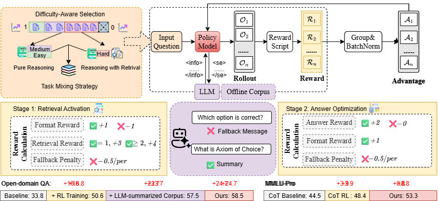

# UR²: Unified RAG and Reasoning through Reinforcement Learning

**Paper coming soon**  
All **data**, **codes**, and other **resources** will be released within **two weeks**.

---

## 🔍 Overview

UR² is a **general framework** that **unifies retrieval-augmented generation (RAG)** and **reinforcement learning (RL)** for **dynamic coordination between retrieval and reasoning**.  
It scales across **mathematical reasoning, medical QA, and general-domain tasks**, matching or surpassing **GPT-4o-mini** with 3B–8B open-source models.

---

## ✨ Highlights

- 🚀 **Unified RAG + RL Framework** — bridges knowledge retrieval and multi-step reasoning.  
- 🎯 **Difficulty-Aware Curriculum** — learns when to retrieve, reducing unnecessary calls.  
- 📚 **Hybrid Knowledge Access** — combines offline corpora + LLM summaries for accuracy and robustness.  
- 🏆 **Two-Stage RL Optimization** — decouples retrieval skill acquisition and answer refinement.  
- 🌏 **Strong Multi-Domain Generalization** — performs well in **math**, **medicine**, **MMLU-Pro**, and **open-domain QA**.

---

## 🛠 Method Overview

1. **LLM-Summarized Retrieval Corpus**  
   - Offline curated corpora + concise LLM summaries.  
   - Reduces hallucinations, boosts cross-domain robustness.

2. **Difficulty-Aware Curriculum**  
   - Categorizes samples into Easy / Medium / Hard.  
   - Retrieval only for harder cases.

3. **Two-Stage RL Training**  
   - **Stage 1:** Train retrieval behavior & query formulation.  
   - **Stage 2:** Refine answer correctness while keeping retrieval skills.

4. **RL Algorithm**  
   - Built on **REINFORCE++**, with retrieval masking and multi-task mixing.  
   - Supports Qwen-2.5-3B/7B-Instruct and LLaMA-3.1-8B-Instruct.

---

## 📊 Performance

### Reasoning & Math
| Model | Hist. | Phil. | Econ. | Law | Avg (MMLU-Pro) | MedQA | M-Med | Avg (Med) | Math500 | Minerva | Avg (Math) |
|-------|-------|-------|-------|-----|----------------|-------|-------|-----------|---------|---------|------------|
| **Qwen-2.5-7B UR²** | **53.2** | **53.0** | **72.2** | **35.0** | **53.3** | **69.6** | **62.8** | **65.9** | **80.9** | **61.0** | **71.0** |
| Qwen-2.5-7B Vanilla RL | 52.2 | 43.5 | 64.0 | 33.8 | 48.4 | 64.2 | 57.4 | 60.8 | 78.2 | 59.4 | 68.8 |
| GPT-4o-mini CoT | 56.7 | 53.1 | 70.4 | 38.2 | 54.5 | 71.4 | 67.0 | 69.2 | 78.0 | 65.6 | 71.8 |

### Open-Domain QA
| Model | HotpotQA | 2Wiki | Bamboogle | MusiQue | Avg (F1) |
|-------|----------|-------|-----------|---------|----------|
| **Qwen-2.5-7B UR²** | **71.2** | **62.6** | **64.5** | **35.8** | **58.5** |
| Qwen-2.5-7B Search-R1 | 72.4 | 61.0 | 58.9 | 32.2 | 56.1 |
| GPT-4.1-mini CoT | 43.7 | 48.6 | 59.2 | 28.3 | 45.0 |

---

## 📅 Release Plan

- **Now** — README + project overview  
- **+2 weeks** —  
  - 📄 Paper preprint  
  - 🧩 Code & scripts  
  - 📚 Datasets & retrieval corpora  
  - 🗂 Model checkpoints

---

## 📜 Citation

Paper link coming soon.

---

⭐ Star this repo if you find it helpful!  

