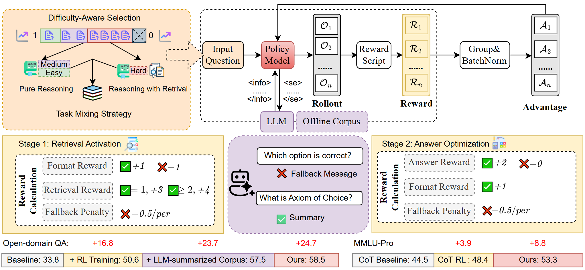

# UR²: Unified RAG and Reasoning through Reinforcement Learning

<div align="center">

</div>

**Paper Link**: [https://arxiv.org/abs/2508.06165]

---

## 🔍 Overview

UR² is a **general framework** that **unifies retrieval-augmented generation (RAG)** and **reinforcement learning (RL)** for **dynamic coordination between retrieval and reasoning**.  
It scales across **mathematical reasoning, medical QA, and general-domain tasks**, matching or surpassing **GPT-4o-mini** with 3B–8B open-source models.

---

## ✨ Highlights

- 🚀 **Unified RAG + RL Framework** — bridges knowledge retrieval and multi-step reasoning.  
- 🎯 **Difficulty-Aware Curriculum** — learns when to retrieve, reducing unnecessary calls.  
- 📚 **Hybrid Knowledge Access** — combines offline corpora + LLM summaries for accuracy and robustness.  
- 🏆 **Two-Stage RL Optimization** — decouples retrieval skill acquisition and answer refinement.  
- 🌏 **Strong Multi-Domain Generalization** — performs well in **math**, **medicine**, **MMLU-Pro**, and **open-domain QA**.

---

## 🛠 Method Overview

1. **LLM-Summarized Retrieval Corpus**  
   - Offline curated corpora + concise LLM summaries.  
   - Reduces hallucinations, boosts cross-domain robustness.

2. **Difficulty-Aware Curriculum**  
   - Categorizes samples into Easy / Medium / Hard.  
   - Retrieval only for harder cases.

3. **Two-Stage RL Training**  
   - **Stage 1:** Train retrieval behavior & query formulation.  
   - **Stage 2:** Refine answer correctness while keeping retrieval skills.

4. **RL Algorithm**  
   - Built on **REINFORCE++**, with retrieval masking and multi-task mixing.  
   - Supports Qwen-2.5-3B/7B-Instruct and LLaMA-3.1-8B-Instruct.
  
---

## 📊 Performance

### Reasoning & Math
| Model | Hist. | Phil. | Econ. | Law | Avg (MMLU-Pro) | MedQA | M-Med | Avg (Med) | Math500 | Minerva | Avg (Math) |
|-------|-------|-------|-------|-----|----------------|-------|-------|-----------|---------|---------|------------|
| **Qwen-2.5-7B UR²** | **53.2** | **53.0** | **72.2** | **35.0** | **53.3** | **69.6** | **62.8** | **65.9** | **80.9** | **61.0** | **71.0** |
| Qwen-2.5-7B Vanilla RL | 52.2 | 43.5 | 64.0 | 33.8 | 48.4 | 64.2 | 57.4 | 60.8 | 78.2 | 59.4 | 68.8 |
| GPT-4o-mini CoT | 56.7 | 53.1 | 70.4 | 38.2 | 54.5 | 71.4 | 67.0 | 69.2 | 78.0 | 65.6 | 71.8 |

### Open-Domain QA
| Model | HotpotQA | 2Wiki | Bamboogle | MusiQue | Avg (F1) |
|-------|----------|-------|-----------|---------|----------|
| **Qwen-2.5-7B UR²** | **71.2** | **62.6** | **64.5** | **35.8** | **58.5** |
| Qwen-2.5-7B Search-R1 | 72.4 | 61.0 | 58.9 | 32.2 | 56.1 |
| GPT-4.1-mini CoT | 43.7 | 48.6 | 59.2 | 28.3 | 45.0 |

---
## 📦 Codebase & Acknowledgement

This project is modified based on  
- [R1-Searcher](https://github.com/RUCAIBox/R1-Searcher)  
- [OpenRLHF](https://github.com/OpenRLHF/OpenRLHF)  

We sincerely thank both projects for their great contributions to the open-source community.  

Compared with **R1-Searcher**, our implementation introduces several key upgrades:  

1. 🔄 **Concurrent Retrieval & Reward**  
   - Modified retrieval and reward modules:  
     - Each rollout now performs concurrent retrieval.  
     - Each step supports concurrent reward evaluation.  
   - Significantly improves training and evaluation efficiency.  

2. 📊 **Enhanced Logging with W&B**  
   - Expanded Weights & Biases (wandb) visualization metrics.  
   - Provides more comprehensive monitoring of training dynamics.  
---

## 🚀 Getting Started

### 1. Install Conda
Make sure you have **Conda** installed for environment management.  
You can download and install it from [Miniconda](https://docs.conda.io/en/latest/miniconda.html) or [Anaconda](https://www.anaconda.com/).

### 2. Clone the Repository
```bash
git clone https://github.com/Tsinghua-dhy/UR2.git
cd UR2
````

### 3. Create Conda Environment

Create a new environment from the provided YAML file:

```bash
conda env create -f environment.yaml
conda activate ur2
```

⚠️ Please make sure the following package versions are exactly matched:

* `flagembedding==1.3.4`
* `flash-attn==2.7.4.post1`
* `vllm==0.6.5`

### 4. Install Local Packages

Install the modified OpenRLHF-RAG module (modified OpenRLHF module) into your local Conda environment:

```bash
cd UR2_RL/OpenRLHF-RAG
pip install -e .
```

---

## 📚 Corpus Preprocessing

UR² requires preprocessing of external corpora for **retrieval-augmented generation**.  
We support both **Wikipedia abstract corpus** (for open-domain QA) and **Wikipedia full corpus**.

### 1. Download Corpora and Embedding model
- **Wikipedia Abstract Corpus** (for HotpotQA & open-domain QA):  
  [Download Link](https://nlp.stanford.edu/projects/hotpotqa/enwiki-20171001-pages-meta-current-withlinks-abstracts.tar.bz2)

- **Wikipedia Full Corpus** (from KILT):  
  [Download Link](http://dl.fbaipublicfiles.com/KILT/kilt_knowledgesource.json)  

- **BGE-Large-en-V1.5**:
  [Download Link](https://huggingface.co/BAAI/bge-large-en-v1.5)
### 2. Preprocess Raw Text
```bash
cd ./retrieval_utils/preprocess

# Preprocess Wikipedia full corpus (KILT version, split into 100 parts)
python process_enwiki_full_split_kilt_to_100.py

# Preprocess Wikipedia abstract corpus
python process_enwiki_abstract.py
````

### 3. Build Embeddings

```bash
# Abstract corpus embedding
python build_corpus_embedding_abstract.py

# Full corpus embedding
python build_corpus_embedding_full.py
```

### 4. Build FAISS Index

```bash
python build_corpus_index_hnsw.py
```

We use **FAISS HNSW** indexing to speed up retrieval.

* ⚡ HNSW provides faster search with only \~2–3 points performance drop in downstream tasks.
* 🖥️ If your server CPU is powerful, you can **disable quantization** for higher accuracy.

### ⚠️ Notes

* Be sure to **update input/output paths** inside the scripts before running.
* Replace the embedding model path with your local copy of **`bge-large-v1.5`**.

---

## 🔎 Start Retrieve

We provide scripts for starting retrieval with different **summary models**.  
Currently, we support both **Qwen-3** and **GPT-based** summarizers.


### 1. Recommended Scripts
- 🚀 **Training:**  
  Use `start_gpt_4.1_suammry_search_o1.sh` to ensure the best **training efficiency**.

- 📐 **Math Task Testing:**  
  Use `start_qwen3_retrieve_search_o1.sh` to achieve **better math performance**.

- 🔀 **Hybrid Mode:**  
  Use `start_mix_retrieve.sh` to automatically **route math queries** to **Qwen-3 summarization**, while using **GPT API summarization** for other queries.


### 2. Prompt Format Options
- `"strong_format"` — Recommended for **training**, helps maximize policy model performance.  
- `"weak_format"` — Recommended for **testing**, often yields better evaluation results.  
- We also provide scripts that **disable summarization models** if needed.


### 3. Setup Steps
#### (1) Load Corpus and Index
```bash
bash load_all_corpus.sh
````

#### (2) Start Retrieval + Summarization Service

```bash
# GPT-based summarization (recommended for training)
bash start_gpt_4.1_suammry_search_o1.sh
```


### ⚠️ Notes

* Make sure to **set the correct paths** for:

  * Corpus files
  * FAISS index files
  * Summarization model (Qwen-3 or GPT)
* Configure your **OpenAI API key** Correctly  
* You can switch models inside the provided shell scripts depending on your task.

---

## 🏋️ Training UR²

Follow these steps to train UR² with retrieval and reward services.

### 1. Start Retrieval
Follow the instructions in the **Start Retrieve** section to launch the appropriate retrieval script.


### 2. Start Reward Service
```bash
cd ./UR2_RL/train
bash start_reward_qwen_7b_medqa_mmlu.sh
````

### 3. Start Ray Distributed Training Service

```bash
cd ./UR2_RL/scripts
bash ray_start.sh
```

### 4. Start Training

```bash
bash start_train.sh
```

### 5. Merge Checkpoints After Training

```bash
cd ./UR2_RL/scripts
bash merge_model.sh
```

### ⚠️ Notes

1. Ensure that all service ports are correct:

   * Corpus interface: `5005` (default)
   * Summarization service: `5006` (default)

2. Make sure the **reward scripts** and **train scripts** are pointing to the correct **training datasets** and **policy model** locations.

3. Provided Resources:

   * We include **Qwen-2.5-7B-Instruct** checkpoints trained on **MedQA** and **MMLU**.
   * Other main experiment datasets and reward scripts are included.

4. **Stage 2 Training (RAG/Math tasks):**

   * After completing Stage 1 training, use the merged checkpoint in the training script for Stage 2.

5. **Customizing Prompts**

   ```bash
   cd ./UR2_RL/OpenRLHF-RAG/openrlhf/datasets/prompts_dataset.py
   ```

   * Modify `preprocess_data` to switch **prompt type** between RAG and Math training tasks.

6. **Retrieval Endpoint Consistency**

   ```bash
   cd ./UR2_RL/OpenRLHF-RAG/openrlhf/trainer/ppo_utils/experience_maker.py
   ```

   * Search for `url_wiki` and make sure the retrieval interface is consistent with your earlier setup.

7. **Using LLaMA Models**
   Update stop tokens and assistant token definitions:

   Change:

   ```python
   stop_tokens = [query_end_token, "<|im_end|>", "<|end_of_text|>"]
   assistant_token = "<|im_start|>assistant"
   ```

   To:

   ```python
   stop_tokens = [query_end_token, "<|eot_id|>", "<|end_of_text|>"]
   assistant_token = "<|start_header_id|>assistant<|end_header_id|>"
   ```
   
8. **LLM-as-a-judge**  
   By default, we use LLM-as-a-judge for training on math tasks.  
   If your training gets stuck, navigate to
   ```
   cd ./UR2_RL/train
   ```
   open `judge_math_answer_gpt.py`, and **configure your OpenAI API key**.
   If you don’t need this, you can modify the reward script accordingly.
   
10. **Wandb Configuration**  
   - If you are in **mainland China** or any region without stable international internet access, please make sure your network is properly configured so that you can `curl` the **wandb** official site.  
   - Otherwise, the training process may **hang** when trying to connect.  
   - If you **do not need wandb**, you can manually modify the code to disable it.  
   - By default, our training scripts are already configured to use **local logging services** without routing through the internet.

## 📊 Evaluation

Follow these steps to evaluate UR² performance.

### 1. Go to Evaluation Scripts
```bash
cd ./eval/eval_scripts
````

### 2. Start Retrieval Service

Make sure the retrieval service is started correctly (see **Start Retrieve** section).

### 3. Run Evaluation Script

```bash
bash eval_mmlupro_multiturn_search_o1.sh
```

We provide scripts for all **main experiments**.
If you need **ablation studies** or baselines for **Advanced RAG / CoT / Standard RAG methods**, feel free to **contact us**.

### ⚠️ Notes

* Make sure to correctly configure OpenAI API in:

  * `metric_calc_rule.py`
  * `./eval/eval_scripts/utils/judge_math_answer_gpt`

* By default, evaluation uses **GPT-4.1-mini** as **LLM-as-a-Judge**.

---

## 💬 Support & Contact

This project is large and complex.  
To ensure you can run it smoothly, please feel free to:

- Open a **GitHub Issue** for bug reports or feature requests.  
- Contact us via email: **liwt23@mails.tsinghua.edu.cn**  
- Or add our WeChat: **G1746223150**  

We are happy to provide further **technical support**.

---

## 📜 Citation

```bibtex
@misc{li2025ur2,
  title        = {{UR$^2$}: Unify RAG and Reasoning through Reinforcement Learning},
  author       = {Weitao Li and Boran Xiang and Xiaolong Wang and Zhinan Gou and Weizhi Ma and Yang Liu},
  year         = {2025},
  eprint       = {2508.06165},
  archivePrefix= {arXiv},
  primaryClass = {cs.CL},
  url          = {https://arxiv.org/abs/2508.06165},
}
```
---

<div align="center">
⭐ Star this repo if you find it helpful!  
</div>

